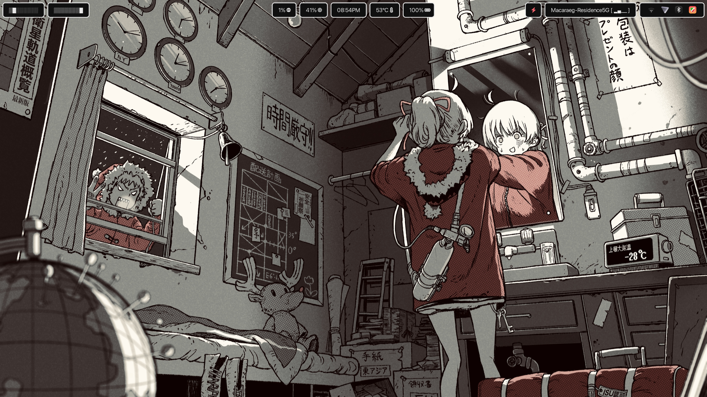
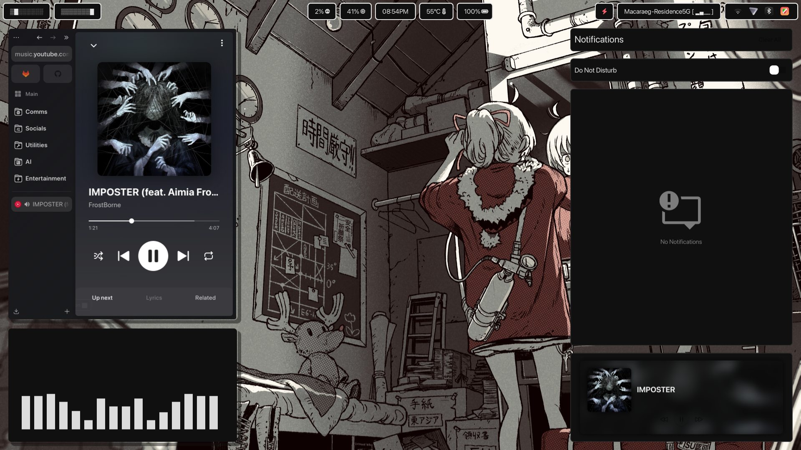
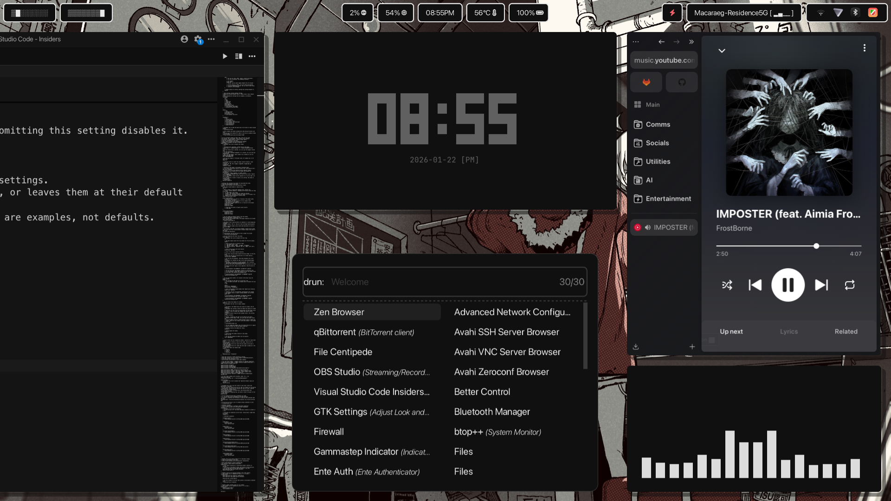
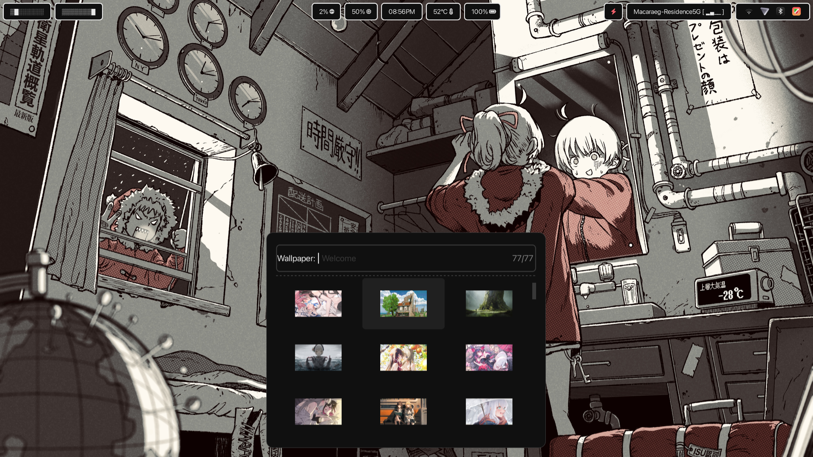

# Nyxiri

My personalized _Niri_ dotfiles with a minimal and monochromatic color scheme.

## Overview

| Component        | Description                                     |
| ---------------- | ----------------------------------------------- |
| **App Launcher** | rofi                                            |
| **Bar**          | waybar                                          |
| **Notification** | swaync                                          |
| **Terminal**     | foot                                            |
| **Wallpaper**    | swww                                            |
| **Logout Menu**  | wlogout                                         |
| **Shell**        | fish + starship                                 |
| **Fonts**        | ttf-jetbrains-mono, ttf-jetbrains-mono-nerd,    |
|                  | ttf-meslo-nerd, apple-fonts, and noto-fonts-cjk |

| Miscellaneous | Description     | Command                                      |
| ------------- | --------------- | -------------------------------------------- |
| hyprlock      | For lockscreen  | Super + L                                    |
| hyprpicker    | For colorpicker | Super + P                                    |
| grim + slurp  | For screenshot  | Super + Shift + S (Region Clipboard)         |
|               |                 | PrtSc (Screen Clipboard)                     |
|               |                 | Super + PrtSc (Save to Pictures/Screenshots) |

| Dependencies             |
| ------------------------ |
| gtk3                     |
| gtk4                     |
| xdg-desktop-portal-gnome |
| xdg-desktop-portal-gtk   |
| wl-clipboard             |
| cliphist                 |

## Installation

1. Install `niri` via your package manager.

2. Ensure you have the following packages and dependencies listed installed.

3. `git clone` the repository to your local machine.

4. Copy the files and directories inside the repo's `.config` folder to your local `.config`.

5. Copy `.icons` and `.themes` to your home directory. Typically denoted by (~).

## Directory Structure

```bash
nyxiri
├── .config
│   ├── fish
│   ├── foot
│   ├── gtk-3.0
│   ├── gtk-4.0
│   ├── niri
│   ├── nwg-look
│   └── starship.toml
├── .icons
│   └── MacTahoe-grey-dark
├── .themes
│   └── Win12X-Fantasy-Compact
└── README.md
```

## Preview





